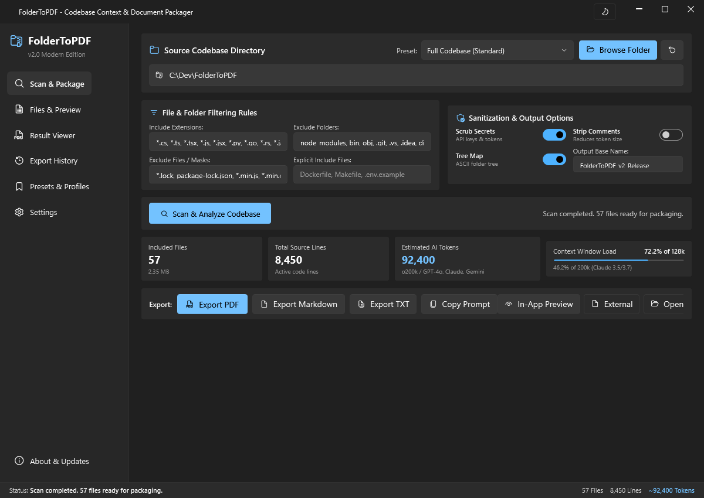

# 📂 FolderToPDF (v2.0 Modern Edition)

[](https://dotnet.microsoft.com/)
[](https://github.com/lepoco/wpfui)
[](LICENSE.txt)


> **FolderToPDF** is a modern, high-performance developer desktop utility designed to ingest, clean, tokenize, and package entire software repositories into polished, token-optimized **PDF**, **Markdown**, and **TXT** documents. Built specifically for LLM prompt engineering (GPT-4o, Claude 3.5/3.7, Gemini 2.0, DeepSeek, Llama 3), code reviews, and architectural documentation.

---

## 📸 Application Preview



---

## 🌟 Key Highlights

### 🧠 Modern AI Tokenizers & Telemetry
- **State-of-the-Art BPE Encodings**: Exact byte-pair encoding powered by SharpToken (`o200k_base` for OpenAI GPT-4o / o1 / o3 and `cl100k_base` for legacy models).
- **Calibrated Multi-Model Algorithms**:
  - **OpenAI GPT-4o / o1 / o3** (`o200k_base`)
  - **Anthropic Claude 3.5 & 3.7 Sonnet** (code-aware BPE calibration)
  - **Google Gemini 2.0 & 1.5 Pro / Flash** (256k SentencePiece UTF-8)
  - **Meta Llama 3 / 3.1 / 3.3** (128k BPE vocabulary)
  - **DeepSeek-V3 & DeepSeek-R1** (128k dense multilingual code BPE)
- **Live Context Gauges**: Real-time progress bars calculating context window load for **128k** (GPT-4o/Llama) and **200k** (Claude/o1).

### 🚀 Compact Zero-Scroll Dashboard
- **Optimized Single-Screen Workflow**: Every primary control — directory selection, active preset, filtering rules, token analytics, and export buttons — is immediately accessible on a single screen without vertical scrolling on 1080p, 1440p, or 4K displays.
- **Windows 11 Fluent Design**: Native Mica backdrop, smooth theme switching (Dark / Light / System), and drag-and-drop folder ingestion.

### 📖 Embedded PDF & Document Viewer
- **Native Microsoft Edge WebView2 Engine**: Inspect generated PDF documents directly within the application with continuous scroll, zoom controls, thumbnails, text search, and print features.
- **Syntax & Monospace Reader**: Built-in reader for Markdown and plain-text code archives with fast navigation, word wrap, and external launch shortcuts.
- **One-Click In-App Preview**: Instantly preview recent exports directly from the Scanner dashboard or Export History table with zero application switching.

### 🗂️ Export History & Projects Hub
- **Dedicated History Tab**: Automatically indexes every generated PDF, Markdown, and TXT archive.
- **Search & Quick Actions**: Instant filtering by project name, format, or directory with one-click actions:
  - Preview inside the integrated in-app document viewer
  - Open generated document in system default viewer
  - Highlight file in Windows File Explorer
  - Copy absolute path to clipboard
  - Track total tokens, file count, and export size

### ⚙️ Extended Export & Output Preferences
- **Custom Output Folder**: Select a dedicated destination directory (e.g. `C:\Exports`) with native folder picker.
- **Automated Workflow**: Option to automatically open Windows File Explorer or launch the generated document immediately upon export completion.
- **Token Saver**: Optional consecutive blank line normalization to compress source files.

### 🛡️ Zero-Trust Secret Scrubber & Comment Cleaner
- **Automated Credential Redaction**: Automatically masks OpenAI, Anthropic, AWS, and GitHub API keys, RSA/SSH private keys, JWT tokens, database passwords, and personal emails before export.
- **Multi-Language Comment Stripper**: Deterministic comment removal for C#, TypeScript, JavaScript, Python, Go, Rust, Java, C++, SQL, HTML, and YAML while preserving string literals.

---

## 📄 Multi-Format Output Options

| Format | Technology | Use Case |
|---|---|---|
| **PDF Document** | QuestPDF Fluent API | High-fidelity print/archive with ASCII tree, headers, syntax-styled blocks, and page numbers. |
| **Markdown Archive** | CommonMark / GFM | GitHub-flavored markdown with language-tagged fenced code blocks, ideal for AI chats. |
| **Plain Text (TXT)** | Stream-optimized | Compact ASCII-delimited plain-text archive for CLI tools and offline review. |
| **Copy Prompt** | Native Clipboard | Copies full formatted markdown prompt directly into memory for instant pasting into AI dialogs. |

---

## 🏗️ Architecture & Clean Design

FolderToPDF is strictly decoupled following **Clean Architecture**, **MVVM**, and **SOLID** principles:

```
FolderToPDF/
├── Core/                              # PURE DOMAIN & APPLICATION LOGIC (Zero UI dependencies)
│   ├── Enums/                         # TokenizerModel, OutputFormat, AppThemeMode
│   ├── Models/                        # Domain entities (AppSettings, ScannedFile, ExportHistoryItem)
│   ├── Interfaces/                    # Service contracts (ITokenCounterService, IExportHistoryService...)
│   └── Services/                      # Pure implementations (TokenCounter, ExportHistory, Scanner...)
├── UI/                                # PRESENTATION LAYER (WPF & WPF-UI)
│   ├── Converters/                    # XAML binding value converters
│   ├── ViewModels/                    # CommunityToolkit.Mvvm ViewModels (≤ 300 lines each)
│   └── Views/                         # Windows 11 Fluent XAML views
└── tests/FolderToPDF.Tests/           # xUnit test suite (57 automated tests)
```

- **Strict File Budget**: No file exceeds 400 lines of code.
- **Strict Quality Gate**: `0 Warning(s), 0 Error(s)` in compiler output with `<GenerateDocumentationFile>true</GenerateDocumentationFile>`.

---

## 🚀 Quick Start & Building

### Prerequisites
- Windows 10/11 (x64)
- [.NET 8.0 SDK](https://dotnet.microsoft.com/download/dotnet/8.0)

### Run from Source
```powershell
git clone https://github.com/vtstv/FolderToPDF.git
cd FolderToPDF
dotnet run
```

### Run Automated Tests
```powershell
dotnet test
```

### Publish Single-File Executable
To generate a single, portable `.exe` without loose dependency DLLs:
```powershell
dotnet publish FolderToPDF.csproj -c Release -r win-x64 --self-contained false -p:PublishSingleFile=true -o publish
```
*(The generated `publish\FolderToPDF.exe` will be ready for distribution.)*

---

## 📄 License & Copyright

- **Author**: Murr ([github.com/vtstv](https://github.com/vtstv))
- **License**: Licensed under the [MIT License](LICENSE.txt).
